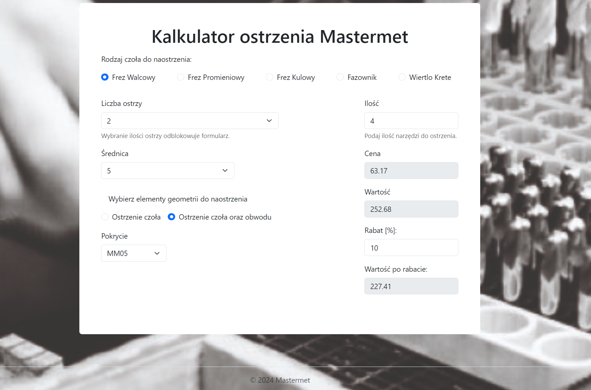
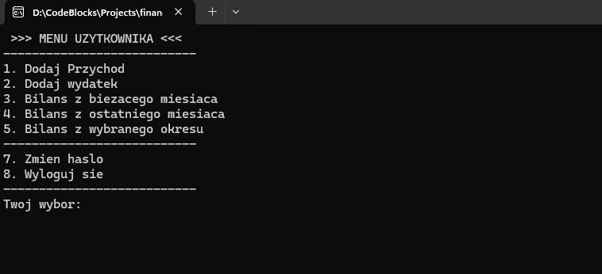

# 💫 About Me:
Hi there 👋 I'm Mateusz from Poland. I am a mechanical engineer transitioning into a backend developer. I enjoy problem-solving tasks and optimizing existing solutions, especially using modern web technologies.

# 💻 Tech Stack:

 

 

# 📂 Portfolio Projects

## Project 1: [E-store admin panel](https://github.com/MateuszWiktorowicz/store-admin-panel.git)
Press picture to see video on youtube!
   
**Description:** Online store admin panel application written in PHP using Symfony.

### The application enables:
- creating user accounts
- creating products, producers and updating stock
- creating and assigning discounts
- creating orders
 

## Project 2: [Regrinding Calculator](https://github.com/MateuszWiktorowicz/regrinding-calc-react.git)
Press picture to see video on youtube!
   
**Description:** Application for calculating the costs of regeneration of cutting tools. Written using JavaScript and React. Receives data from a REST API created with Symfony.
 

## Project 3: [Personal Finances](https://github.com/MateuszWiktorowicz/PersonalFinancesMVC.git)
Press picture to see video on youtube!
   
**Description:** A home budget management application written in JavaScript and PHP with the creation of your own MVC framework.

### The application enables:
- Creating an account and configuring expense and income categories
- Setting a spending limit for a given category
- Adding expenses and revenues in a specific period
- Balance check
 

## Project 4: [Personal Finances C++](https://github.com/MateuszWiktorowicz/financeApp.git)
Press picture to see video on youtube!
   
**Description:** Financial application written in object-oriented C++. In the application, you can create a user account, add and view income and expenses.
 

# 📊 GitHub Stats:
 
 

---
